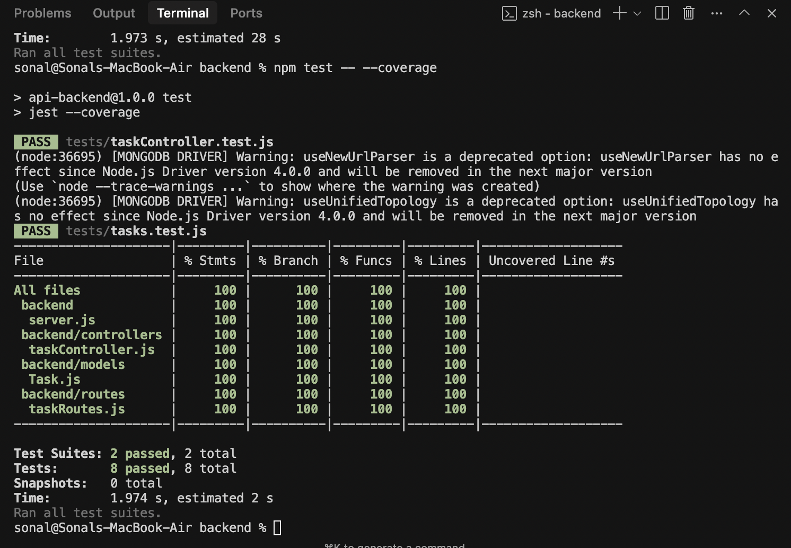

# Task Manager API Project

## Testing

Our project includes a comprehensive suite of tests to ensure the reliability and correctness of the backend API. We have implemented unit, integration, and API tests to cover different aspects of the application.

### How to Run Tests

You can run all tests at once or target specific test suites. From the `backend` directory, use the following commands:

#### Run All Tests
This command executes the entire test suite and generates a coverage report.
```sh
npm test
```

#### Run Unit Tests
These tests focus on individual controller functions.
```sh
npm test -- tests/taskController.test.js
```

#### Run API & Integration Tests
These tests check the API endpoints and their integration with the database.
```sh
npm test -- tests/tasks.test.js
```

### Keploy API Testing Integration

We have integrated **Keploy AI-powered API testing** into our CI/CD pipeline for enhanced API testing capabilities.

#### Setup Instructions

1. **Install Keploy CLI locally:**
   ```sh
   curl --silent -L https://keploy.io/ent/install.sh | bash
   ```

2. **Start your application:**
   ```sh
   cd backend
   npm start
   ```

3. **Record API interactions:**
   ```sh
   keploy record --app task-manager-api --base-path http://localhost:5001/api
   ```

4. **Run Keploy tests:**
   ```sh
   keploy test --app task-manager-api --base-path http://localhost:5001/api
   ```

#### CI/CD Integration

Our GitHub Actions workflow (`.github/workflows/ci.yml`) automatically:
- Runs existing unit and integration tests
- Installs Keploy CLI
- Executes Keploy API tests
- Generates test reports and coverage

**To complete the Keploy setup:**
1. Go to [app.keploy.io](https://app.keploy.io)
2. Create a test suite for your API
3. Copy the test command from the dashboard
4. Add your `KEPLOY_API_KEY` as a GitHub secret
5. Update the workflow file with your actual app ID and base path

### Test Coverage & Output

We have achieved **100% test coverage** for the backend modules exercised by our tests. The coverage report below shows the breakdown for our controllers, models, and routes.

*Note: The main server entrypoint (`index.js`) and database configuration (`config/db.js`) are not included in this report as they are bypassed in our test environment in favor of an in-memory server and database.*



Here is a sample of the output when running the full test suite:
```text
> api-backend@1.0.0 test
> jest --coverage

 PASS  tests/taskController.test.js
 PASS  tests/tasks.test.js
---------------------|---------|----------|---------|---------|-------------------
File                 | % Stmts | % Branch | % Funcs | % Lines | Uncovered Line #s 
---------------------|---------|----------|---------|---------|-------------------
All files            |     100 |      100 |     100 |     100 |                   
 backend             |     100 |      100 |     100 |     100 |                   
  server.js          |     100 |      100 |     100 |     100 |                   
 backend/controllers |     100 |      100 |     100 |     100 |                   
  taskController.js  |     100 |      100 |     100 |     100 |                   
 backend/models      |     100 |      100 |     100 |     100 |                   
  Task.js            |     100 |      100 |     100 |     100 |                   
 backend/routes      |     100 |      100 |     100 |     100 |                   
  taskRoutes.js      |     100 |      100 |     100 |     100 |                   
---------------------|---------|----------|---------|---------|-------------------
Test Suites: 2 passed, 2 total
Tests:       8 passed, 8 total
Snapshots:   0 total
Time:        1.925 s
Ran all test suites.
```

### Tech Stack for Testing

- **[Jest](https://jestjs.io/):** A delightful JavaScript Testing Framework with a focus on simplicity. We use it as our primary test runner and assertion library.
- **[Supertest](https://github.com/visionmedia/supertest):** Used for testing HTTP assertions, allowing us to test our API endpoints in a way that resembles how they are used in production.
- **[MongoDB Memory Server](https://github.com/nodkz/mongodb-memory-server):** This library spins up an in-memory MongoDB instance, allowing us to run tests against a real MongoDB database without connecting to an external server. This is great for integration testing our database logic.
- **[Keploy](https://keploy.io/):** AI-powered API testing platform that automatically generates and maintains API tests from real user interactions.

### Types of Tests

-   **Unit Tests:** These tests focus on individual components (e.g., controller functions) in isolation. While we use an in-memory database, which leans towards integration testing, the tests in `backend/tests/taskController.test.js` verify the logic within the controllers.
-   **Integration Tests:** Our tests ensure that the API server and the database work together as expected. By using `mongodb-memory-server`, we test the full CRUD operations from the controller to a database instance.
-   **API Tests:** Located in `backend/tests/tasks.test.js`, these tests use `supertest` to make live HTTP requests to our API endpoints. They verify that the API behaves correctly, checking status codes, response bodies, and headers for all defined routes.
-   **Keploy AI Tests:** AI-generated API tests that automatically adapt to API changes and provide comprehensive coverage of real-world usage patterns.

---

## Overview

A simple full-stack app with:
- **Backend:** Node.js + Express + MongoDB
- **Frontend:** React
- **Features:** CRUD for tasks

---

## API Documentation

### OpenAPI Schema

We provide a complete OpenAPI 3.0.3 specification in `openapi.yaml` that documents all endpoints, request/response schemas, and examples.

### 1. Get all tasks
- **Endpoint:** `GET /api/tasks`
- **Response:**
```
[
  { "id": 1, "title": "Sample", "description": "Test", "completed": 0 }
]
```

### 2. Create a task
- **Endpoint:** `POST /api/tasks`
- **Body:**
```
{ "title": "New Task", "description": "Details" }
```
- **Response:**
```
{ "id": 2, "title": "New Task", "description": "Details", "completed": 0 }
```

### 3. Update a task
- **Endpoint:** `PUT /api/tasks/:id`
- **Body:**
```
{ "title": "Updated", "description": "Updated", "completed": 1 }
```
- **Response:**
```
{ "updated": 1 }
```

### 4. Delete a task
- **Endpoint:** `DELETE /api/tasks/:id`
- **Response:**
```
{ "deleted": 1 }
```

---

## Sample curl Commands

```sh
# Get all tasks
curl http://localhost:5000/api/tasks

# Create a task
curl -X POST -H "Content-Type: application/json" -d '{"title":"Test","description":"Try"}' http://localhost:5000/api/tasks

# Update a task
curl -X PUT -H "Content-Type: application/json" -d '{"title":"Done","description":"Finished","completed":1}' http://localhost:5000/api/tasks/1

# Delete a task
curl -X DELETE http://localhost:5000/api/tasks/1
```

---

## How to Run

### Backend

```sh
cd backend
npm install mongoose dotenv
npm start
```

### Frontend

```sh
cd frontend
npm install
npm start
```

Open [http://localhost:3000](http://localhost:3000) in your browser.

---

## Database

- Uses MongoDB
- No setup needed; tables auto-created.

---

## How to Interact

- Use the frontend UI for CRUD.
- Use curl or Postman for API testing.

---

## License

MIT 